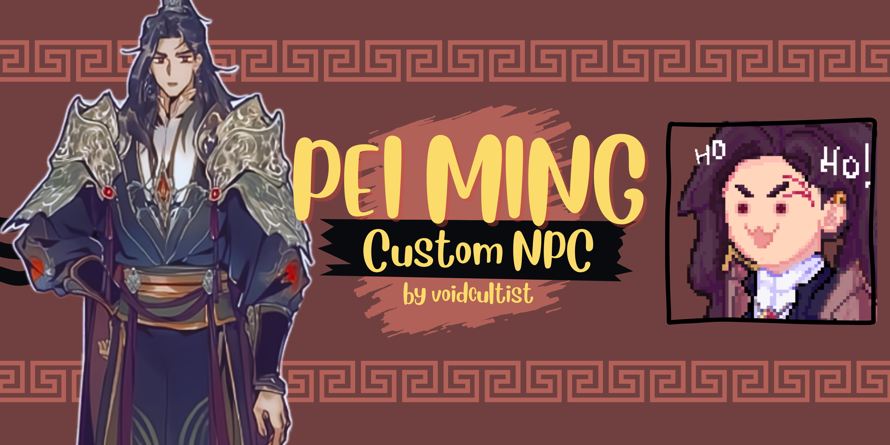

# NPC Pei Ming

1. [Introduction](#introduction)

2. [General](#general-information)

 * [Hard Requirments](#hard-requirements)
 * [Soft Requirements](#soft-requirements)
 * [Suggested Mods](#suggested-mods)
 * [Roommate](#roommate)
 
3. [Progression Requirements](#progression-requirements)

  * [Heart Events](#heart-events)
  * [Other Events](#other-events)
  
4. [Letters](#letters)

5. [Special Orders and Quests](#special-orders-and-quests)
6. [Gift Tastes](#gift-tastes)

## Introduction
This mod adds the custom NPC Pei Ming from the Chinese novel series "Heaven Officials' Blessing" by Mo Xiang Tong Xiu to Stardew Valley, attempting to flesh out the character beyond the comic relief the novels had reduced him to. No knowledge of the story will be required to use this mod as it was written for all players in mind.
This readme provides gameplay information for players to look up. 
## General Information

### Hard Requirements
The following mods absolutely **must** be installed for this one to work:

- [SpaceCore](https://www.nexusmods.com/stardewvalley/mods/1348)
- [Custom Schedule Keys](https://www.nexusmods.com/stardewvalley/mods/31271)
- [Lumisteria Tilesheets Indoor](https://www.nexusmods.com/stardewvalley/mods/9599)
- [HxW Tilesheets](https://www.nexusmods.com/stardewvalley/mods/20139)
- [PC's Tilesheets](https://www.nexusmods.com/stardewvalley/mods/38116)
- [Northern Heart Melon](placeholder)

And of course, SMAPI and Content Patcher.

### Soft requirements
The following mods are not required for the mod to work.

- [Generic Mod Config Menu](https://www.nexusmods.com/stardewvalley/mods/5098)
- [Look Up Anything]

### Suggested Mods
Mods that neatly tie in with this one and enhance it, some of them have added compatibility, but none of them are required.
- [Cornucopia More Flowers](https://www.nexusmods.com/stardewvalley/mods/20290): additional gift tastes for NPC and spawns in custom Location
- [Polyamory Mod](https://github.com/EnderTedi/Polyamory): enables polyamory setting for NPC
- [Hugs and Kisses](https://www.nexusmods.com/stardewvalley/mods/10062): for Roommate kisses! yay!
- [Platonic Partners and Friendships](https://www.nexusmods.com/stardewvalley/mods/8146): custom relationship labels!
- [Lookup Anything](https://www.nexusmods.com/stardewvalley/mods/541): just a generally very useful mod for checking schedules, gift tastes etc

Other than that, the mod is compatible with Stardew Valley Expanded. Should compatibility issues with other mods pop up, please let me know.

### Roommate
Pei Ming is an NPC that can become the farmer's roommate. In this mod, he was written to be allo-aro. Using [GMCM](https://www.nexusmods.com/stardewvalley/mods/5098) or by editing the config.json, you can choose whether you want him to behave like a vanilla roommate with his new roommate schedule intact or as platonic partner which will make him ignore the roommate schedule and adhere to a custom one. Please keep in mind that the latter is highly experimental and might come with bugs that are hard to circumvent due to hardcoded limitations. None of those bugs are gamebreaking but could involve dialogue lines not firing, the spouse room disappearing etc. Please do report if you run into any issues. 

How do I become roommates with Pei Ming?

Regardless of which of the partnership options you have picked, you will have to gift the item **Giftable Tassel** to Pei Ming. Here's how to get it:

| How to obtain? |Price | 
| ------------- | ------------- |
| Volcano Trader with at least 8 Hearts with Pei Ming and at least 1 farmhouse upgrade | 125000 / 250000 / 500000 |

This item does nothing on its own and is only used to propose to Pei Ming to become roommates.

Additionally, once you have seen the roommate proposal event, the Volcano Trader will offer a new, equippable tassel:

| How to obtain? |Price | 
| ------------- | ------------- |
| Volcano Trader after having received the [Giftable Tassel](#giftable-tassel) recipe and having gifted said tassel to Pei Ming |  250000 / 500000 / 750000 |

## Progression Requirements
As of version 1.0.0, there are 7 Heart Events and 3 other Events, with more events coming soon. If you can't seem to be able to unlock the events, refer to the following section for the conditions. If all of the conditions apply but you can still not access the event, do report this to me.

### Heart Events

First Meeting

| Location | Requirements |
|----------|--------------|
|Forest	   |none. simply head to the forest and the event should play as soon as the mod is installed.|

Wizard wants to talk about Pei Ming

| Location | Requirements |
|----------|--------------|
|Wizard's House	   | must have seen the "First Meeting" event|
|				   | must have seen the event in which the wizard enables the player to understand the Junimo|
|				   | must have received the letter in which the Wizard invites the player to talk about Pei Ming|

2-Heart-Event

| Location | Requirements |
|----------|--------------|
|Museum    | must have seen the aforementioned event|
|	       | Friendship with Pei Ming needs to be at 2 Hearts ( = 500 points) |

3-Heart-Event

| Location | Requirements |
|----------|--------------|
|Mines     | must have seen the aforementioned event|
|		   | Friendship with Pei Ming needs to be at 3 Hearts ( = 750 points) |

4-Heart-Event

| Location | Requirements |
|----------|--------------|
|Saloon OR | must have seen the aforementioned event|
|Mountains | Friendship with Pei Ming needs to be at 4 Hearts ( = 1000 points) |
|		   | between 18:00 and 22:00 |
|		   | Rainy weather |

5-Heart-Event

| Location | Requirements |
|----------|--------------|
|Pei Ming's house| must have seen the aforementioned event|
|                | Friendship with Pei Ming needs to be at 5 Hearts ( = 1250 points) |
|		         | between 6:00 and 9:00 |

6-Heart-Event

| Location | Requirements |
|----------|--------------|
|Beach | must have seen the aforementioned event|
|      | Friendship with Pei Ming needs to be at 6 Hearts ( = 1500 points) |
|	   | between 19:00 and 24:00 |
|	   | Sunny weather |
|      | player must have received the letter with the Glazed Heart Melon recipe |	

7-Heart-Event

| Location | Requirements |
|----------|--------------|
|Saloon | must have seen the aforementioned event|
|      | Friendship with Pei Ming needs to be at 6 Hearts ( = 1750 points) |
|	   | between 18:00 and 24:00 |
|	   | Saturday or Sunday |
|	   | Rainy weather |
|      | player must have received the letter with in which Pei Ming invites the player to the saloon |	

### Other Events

Encounter with Haley

| Location | Requirements |
|----------|--------------|
|Town  | Season: Spring   |
|      | Friendship with Haley and Pei Ming needs to be at 350 points (roughly 1.5 hearts) |
|	   | between 12:00 and 17:00 |
|      | Sunny weather |

Tanghulu Event

| Location | Requirements |
|----------|--------------|
|Pei Ming's house  | Player must have received the letter in which Pei Ming invites the player to make tanghulu together |
| 			       | between 10:00 and 15:00 |

Roommate Proposal Event

| Location | Requirements |
|----------|--------------|
|Pei Ming's house  | Player must gift Pei Ming the item "Giftable Tassel" - the event should trigger right after |

This event gives the player the option to become Roommates with Pei Ming. It should be repeatable if Pei Ming was not invited to become the player's roommate the first time. Please do report if there's any issues.

## Letters
Some letters are requirements for certain events or quests, others add items or recipes. The following lists the triggers for the letters that are relevant to story progression/event unlocks:

 Wizard Letter 1: "So about this General..." 

Requirements:
 
* must have seen the "First Meeting" event
* must have seen the event in which the wizard enables the player to understand the Junimo

Invitation to the Mountains or the Saloon (4 Heart Event): "Your invitation." 

Requirements:
 
* player must have seen the 3-Heart-Event and picked either the Saloon or the mountains. If the event has been skipped, this defaults to Saloon.
* Friendship points with Pei Ming: 1000 (4 Hearts)

(Another) Invitation to the Saloon (7 Heart Event): "Invitation to the Saloon" 

Requirements:
 
* player must have seen the 6-Heart-Event
* Friendship points with Pei Ming: 1750 (7 Hearts)
* rainy weather

Invitation to make tanghulu at Pei Ming's house: "Making Tanghulu" 

Requirements:
* player must have completed the "Tanghulu Ingredients Required!" special order

Tanghulu recipe letter: "Tanghulu Recipe" 

Requirements:
* player must have seen the event in which the player makes Tanghulu with Pei Ming

Sleepover letter: "Come over anytime!" 

Requirements:
* Friendship points with Pei Ming: 1000 (4 Hearts)

unlocks warp points between Pei Ming's house and the bus stop and lets the player sleep in Pei Ming's bed

Heart Melon seeds quest letter: "Northern Heart Melon seeds!" 

Requirements:
 
* Friendship points with Pei Ming: 1250 (5 Hearts)
* Season: Fall

Should unlock the Heart Melon quest.

Glazed Heart Melon recipe letter: "Cooking with the Northern Heart Melon." 

Requirements:
* must have completed the Northern Heart Melon quest

Huangjiu unlock letter: "Regarding my special order" 

Requirements:
* player must have completed the "Refined Tastes" special order

Should unlock option to make Huangjiu in kegs

## Special Orders and Quests
This mod adds 2 Special Orders and some quests.
### Quests
| Quest | Unlock Conditions |
|----------|--------------|
|Tanghulu quest  | Player must have received the letter in which Pei Ming invites the player to make tanghulu together |

### Special Orders
| SO | Unlock Conditions | Reward |
|----------|--------------|------------------------|
| "Tanghulu ingredients required! | Season: Spring or Summer, 4 Hearts with Pei Ming | Unlock tanghulu recipe |
| "A Martial God's refined tastes" | Season: Fall or Winter, 7 Hearts with Pei Ming | Unlock huangjiu for kegs |

## Gift tastes
### Loved
* Vanilla: banana, super cucumber, eggplant, general loves
* Cornucopia: Candied Cherries, Chocolate Banane, Winter Rose, Prismatic Rose
* WAG: Flavored Chocolate Truffles
* Northern Heart Melon: Northern Heart Melon, Heart Melon Huanjiu
* Added by this mod: Tanghulu

### Likes
* Vanilla: truffle, truffle oil, caviar, wine, ruby, pomegranate, squid ink general likes
* Cornucopia: candied apple, all other kinds of roses
* SVE: Winter star rose

### Dislikes
* Pickles

### Hates
* Ancient Sword
* SVE: Bone Fish

